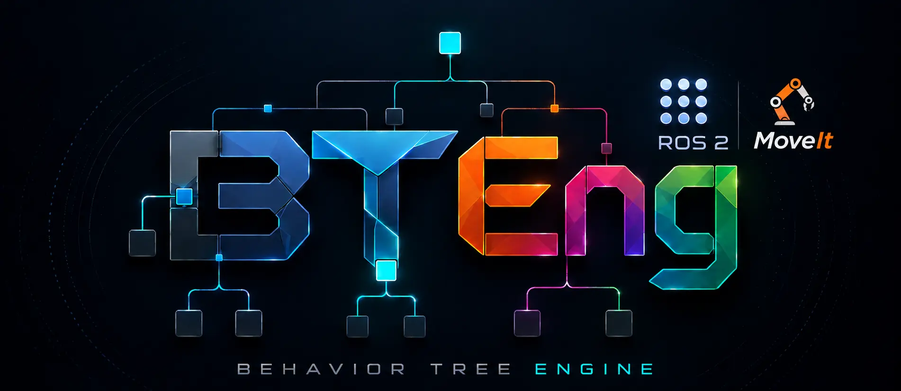

<p align="center">
  
</p>

# bteng-moveit

[](https://pypi.org/project/bteng-moveit/)
[](https://www.python.org/)
[](LICENSE)
[](pyproject.toml)
[](https://pypi.org/project/bteng/)
[](https://pypi.org/project/bteng-ros2/)

MoveIt 2 behaviour-tree nodes for the [BTEng](https://pypi.org/project/bteng/)
behavior tree engine.

Every MoveIt 2 action server, service and topic a manipulation app needs is a
composable BTEng node. A project needs **no application Python** — a params
file, a tree, and one command.

## Install

```bash
source /opt/ros/jazzy/setup.bash    # or kilted / rolling — Python 3.12+
pip install bteng-moveit
```

`bteng>=0.3.2` and `bteng-ros2>=0.3.0` are pulled in automatically. MoveIt 2
message packages (`moveit_msgs`, `shape_msgs`, …) come from the ROS 2
installation you *run* in — they are not needed to install, import, or
`--dry-run`. Supported distributions and why the two floors are hard:
[Getting started](docs/getting-started.md).

## Run a tree with one command

The tree holds the order things happen in; the params file holds the values.
Poses are built in YAML because a BT XML attribute is a string and `PlanToPose`
wants a real `geometry_msgs/PoseStamped`.

```xml
<Sequence name="plan_then_execute">
  <IsMoveGroupReady name="ready" />
  <PlanToPose name="plan" pose="{grasp_pose}" planning_group="{arm_group}"
              link_name="{eef_link}" trajectory="{trajectory}" />
  <ExecuteTrajectory name="execute" trajectory="{trajectory}" />
</Sequence>
```

```bash
bteng-moveit run trees/ -p params.yaml                    # run every tree in the directory
bteng-moveit run trees/ -p params.yaml --dry-run          # parse + build only: CI gate, no robot
bteng-moveit run trees/ -p params.yaml --namespace /left  # one arm of a dual-arm cell
bteng-moveit nodes                                        # list every XML tag
```

Exit code is 0 only if every tree succeeded. The matching `params.yaml` and a
walk-through are in [Getting started](docs/getting-started.md); every flag is in
[CLI](docs/cli.md); every params `type:` is in
[Params file reference](docs/params.md).

## Nodes

19 node classes, each registered under two XML tags — the short form
(`PlanToPose`) and the class name (`PlanToPoseNode`).

| Kind | Nodes |
|---|---|
| Actions | `PlanToPose`, `PlanToJointValues`, `ExecuteTrajectory`, `MoveGroup`, `GripperOpen`, `GripperClose` |
| Services | `ComputeCartesianPath`, `ComputeIK`, `ComputeFK`, `GetPlanningScene`, `ApplyPlanningScene`, `ClearOctomap` |
| Topics | `GetJointState`, `AddCollisionObject`, `RemoveCollisionObject`, `AttachObject`, `DetachObject` |
| Conditions | `IsMoveGroupReady`, `IsAtJointTarget` |

Every endpoint is also an input port, so a tree retargets one node without a
subclass: `<PlanToPose action_name="/left/move_action" ... />`. Full port tables,
endpoints and the traps worth knowing before wiring a pick:
[Node reference](docs/nodes.md).

## Runs offline

`import bteng_moveit` succeeds on a machine with **no ROS 2 installed**. Every
node defers its ROS 2 and MoveIt imports to the first tick, and a test walks the
AST of every module to keep it that way.

So `--dry-run` is a real CI gate: every tree parses, every tag resolves, every
port exists and every params value validates, on a runner with no ROS.

```bash
pip install -e ".[dev]"
pytest test/ -v                                            # 492 tests, ~1 s
bteng-moveit run examples/trees/ -p examples/config/moveit_params.yaml --dry-run
```

What works without ROS 2 and what cannot: [Testing](docs/testing.md).

## Examples

Five trees and a params file exercising every value type, in
[`examples/`](examples) — from a plan-and-execute pair up to a full pick and
place. None needs a robot to check; see
[Getting started](docs/getting-started.md#working-examples).

## Documentation

| Page | Covers |
|---|---|
| [Getting started](docs/getting-started.md) | Requirements, supported ROS 2 distributions, first tree |
| [Params file reference](docs/params.md) | Every `type:`, orientation, collision geometry, named targets |
| [Node reference](docs/nodes.md) | All 19 nodes with full port tables |
| [CLI](docs/cli.md) | `run` and `nodes`, every flag, `--dry-run` as a CI gate |
| [Design](docs/design.md) | Lazy imports, MoveIt error codes, port direction, namespaces |
| [Python API](docs/python-api.md) | Using the library without the CLI |
| [Testing](docs/testing.md) | Running the suite, and your trees, with no ROS 2 |
| [Changelog](docs/changelog.md) | What changed, and why |

## Status

492 offline tests, plus a companion validation project that contains no
application Python and asserts it mechanically.

**Never run against a real MoveIt.** The development machine has no ROS 2, so
server behaviour, DDS timing, `use_sim_time` and action callbacks are stub-tested
only. Message field names *were* verified against the upstream definitions,
because the stubs accept any attribute and so could not do it for us.

Upgrading from 0.1.0 needs two edits to an existing tree — `/move_group` →
`/move_action`, and `ComputeIK`'s seed port is now `seed_state`. Both, and the
five defects that made 0.1.0 unable to run against a real MoveIt, are in the
[changelog](docs/changelog.md).

## Contributing

Issues and pull requests are welcome at
[BTEng-dev/bteng-moveit](https://github.com/BTEng-dev/bteng-moveit). CI runs
ruff, the offline suite and a `--dry-run` of every shipped tree — the four
commands are listed in [Testing](docs/testing.md#linting); run them before
opening a PR.

## Related projects

| Project | What it is |
|---|---|
| [`bteng`](https://github.com/BTEng-dev/bteng) | The behaviour-tree engine — no runtime dependencies |
| [`bteng-ros2`](https://github.com/BTEng-dev/bteng-ros2) | ROS 2 action, service, topic and condition base classes |

## License

MIT — see [LICENSE](LICENSE).
